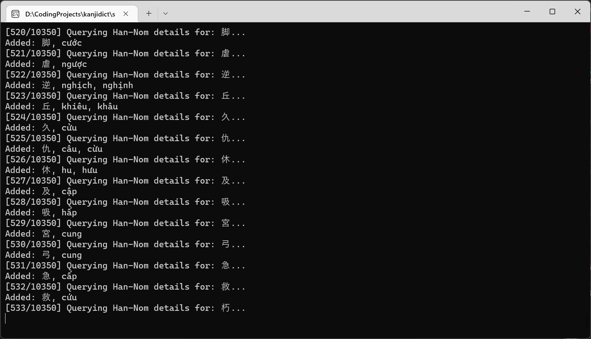
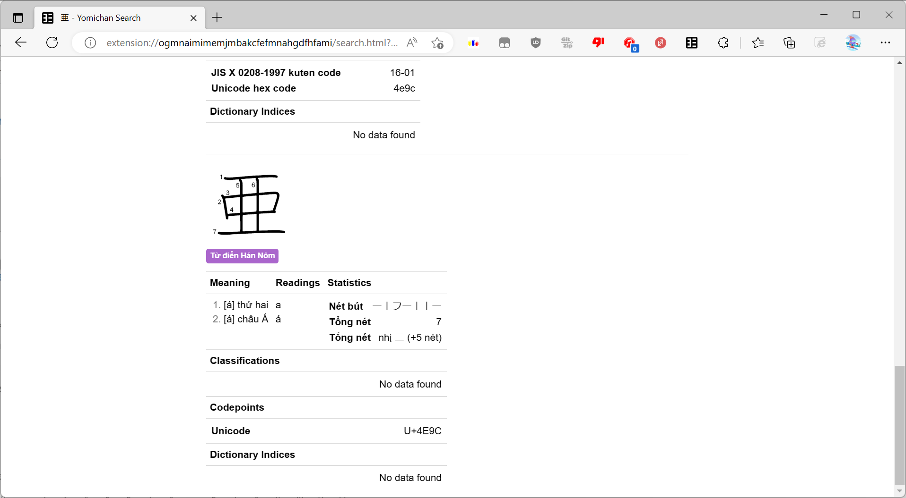
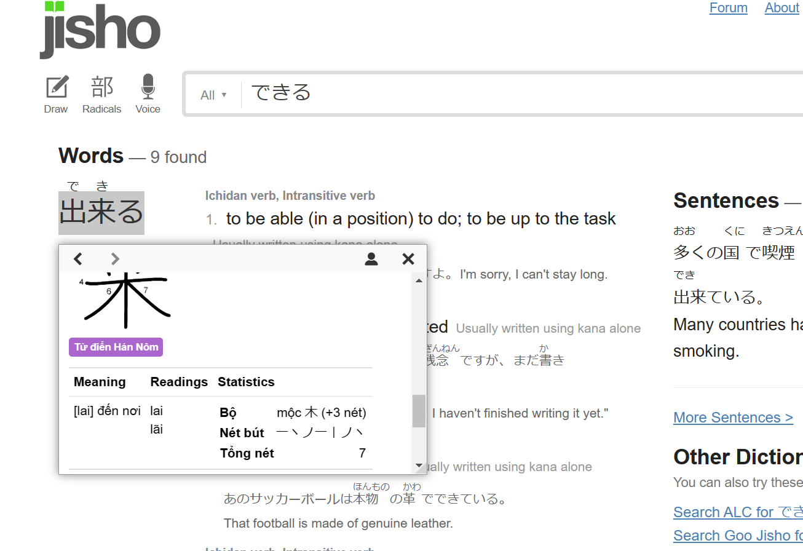

# KanjiDictVN
Từ điển chữ Hán (Kanji) tiếng Nhật với âm đọc Hán - Việt và giải nghĩa Hán Việt.

Dựa trên từ điển [KANJIDIC (English)](https://github.com/yomidevs/jmdict-yomitan) và dữ liệu trên trang web [Từ điển Hán Nôm](https://hvdic.thivien.net/).

Bao gồm 10350 mục Hán tự để sử dụng với ứng dụng từ điển [Yomichan](https://github.com/FooSoft/yomichan).

## Hướng dẫn

### Cài đặt từ điển
- Clone repo này.
- Nén tất cả các file trong thư mục `out_vn` thành một file `.zip`. Chú ý rằng, file `index.json` phải nằm ở gốc của file `.zip`, không được để thư mục `out_vn` xuất hiện trong file `.zip`.
- `Import` từ điển này vào Yomichan như bất cứ từ điển nào khác.

### Tự xây dựng từ điển
- Clone và chạy chương trình `Generator` trong thư mục `src`.
- Đợi một lúc để chương trình tải và xử lý dữ liệu Hán tự.
- Làm lại các bước như mục "Cài đặt từ điển".

### Cập nhật từ điển từ dữ liệu của từ điển Hán Nôm
- Clone repo này.
- Xóa các file trong `hvcache` tương ứng với các ký tự bạn muốn cập nhật, hoặc xóa cả thư mục nếu bạn muốn cập nhật toàn bộ từ điển.
- Chạy chương trình `Generator` trong thư mục `src`.
- Đợi một lúc để chương trình tải và xử lý dữ liệu Hán tự.
- Làm lại các bước như mục "Cài đặt từ điển".

## Bản quyền
Tất cả mã nguồn chương trình trong dự án thuộc sở hữu (C) 2023-2025 Nguyễn Thành Trung.

KANJIDIC (English) thuộc bản quyền của [Electronic Dictionary Research and Development Group](https://www.edrdg.org/wiki/index.php/KANJIDIC_Project#Copyright_and_Permissions), và được sử dụng dưới [giấy phép](https://www.edrdg.org/edrdg/licence.html) của họ.

Cách đọc và giải nghĩa tiếng Việt thuộc sở hữu (C) 2001-2025 hvdic.thivien.net

## Ảnh

Quá trình sinh từ điển:

Từ điển Hán Nôm:

Từ điển trên một trang web trên Microsoft Edge:

